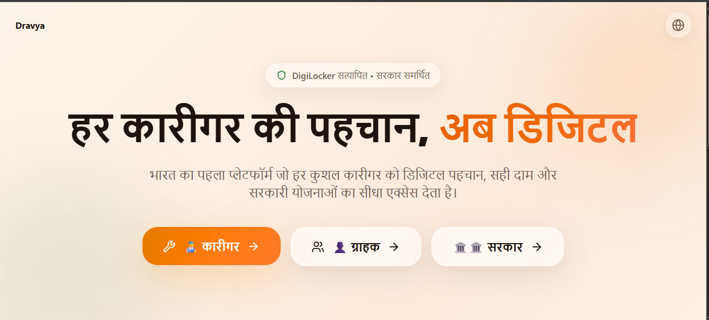
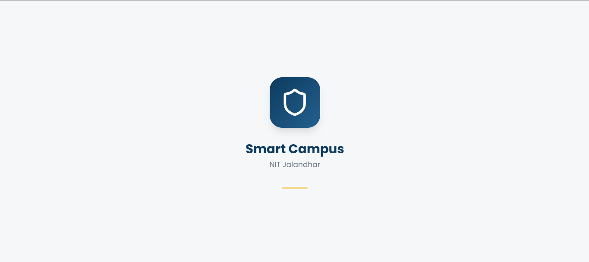
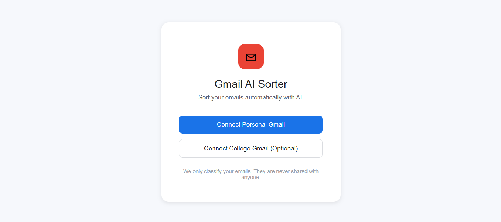
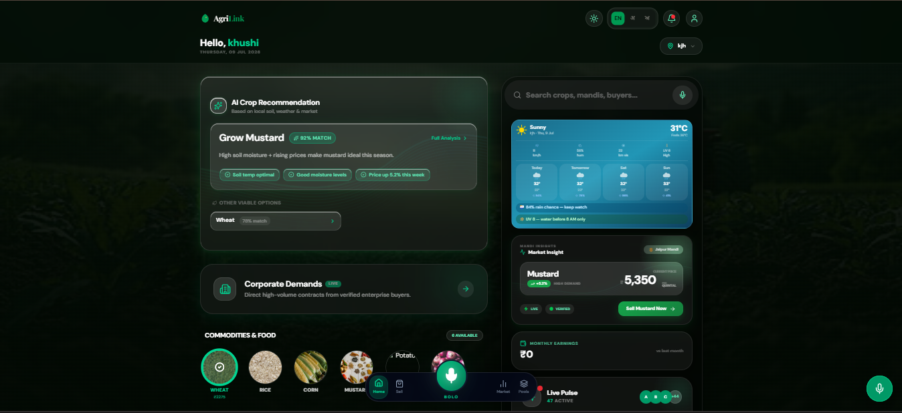

<div align="center">


</div>

<h1 align="center">Hi, I'm Suhani 👋</h1>

<p align="center">

</p>

<p align="center">
<a href="https://github.com/suhani-510"></a>
<a href="https://www.linkedin.com/in/suhani-shakrwal-778496325"></a>
<a href="mailto:shakrwalsuhani510@gmail.com"></a>
</p>

<p align="center">
  
  
  
</p>

<br>

<div align="center">

```diff
+ Building clean, functional UIs with React
+ Leveling up into Full-Stack Development
+ Exploring AI / ML on the side
```

</div>


## 🧠 About Me

I'm a **Frontend Developer** studying **B.Tech in Data Science** at **NIT Jalandhar**, who loves turning ideas into real, working products. Right now I'm:

- 🎨&nbsp; Building responsive, polished UIs with **React, Vite & Tailwind**
- 🔧&nbsp; Leveling up into **Full-Stack Development** — Node.js, Express, MongoDB, JWT auth
- 🤖&nbsp; Exploring **AI / ML** and how it plugs into real products
- 🧩&nbsp; Practicing **DSA & problem-solving** to sharpen my fundamentals
- 🌏&nbsp; Passionate about culturally-grounded, creative digital products


## 🛠️ Tech Stack

<p align="center">

</p>
<p align="center">

</p>
<p align="center">

</p>
<p align="center">

</p>


<h2 align="center">🚀 Featured Projects</h2>

<br>

<table width="100%">
<tr>
<td width="55%" valign="middle">


</td>
<td width="45%" valign="middle">

### 📖 Satya-Setu — Living History

Bilingual (Hindi/English) AI-powered app exploring Indian history & culture — featuring a 3D book library, AI chat, an OCR-based book scanner, and a dedicated women's history module (Naari Itihas).

`React` `AI Chat` `OCR` `Bilingual UI`

**[📂 View Repository →](https://github.com/suhani-510/satya-setu-living-history)**

</td>
</tr>
</table>

<br>

<table width="100%">
<tr>
<td width="45%" valign="middle">

### 🛠️ Kaam-Setu

A full-stack web platform built to connect people with work and services — bridging opportunity and access for local communities.

`React` `Node.js` `MongoDB`

**[📂 View Repository →](https://github.com/suhani-510/kaam-setu)**

</td>
<td width="55%" valign="middle">



</td>
</tr>
</table>

<br>

<table width="100%">
<tr>
<td width="55%" valign="middle">



</td>
<td width="45%" valign="middle">

### 🏫 Smart Campus NITJ

Full-stack campus portal, migrated from Supabase to a custom **MongoDB + Express/JWT** backend — built to streamline everyday campus life.

`React` `Vite` `Node.js` `Express` `MongoDB` `JWT`

**[📂 View Repository →](https://github.com/suhani-510/smart-campus-nitj)**

</td>
</tr>
</table>

<br>

<table width="100%">
<tr>
<td width="45%" valign="middle">

### 📬 Gmail AI Sorter

AI-powered email classifier using the **Groq API**, currently being expanded to support secure multi-user Google OAuth.

`Node.js` `Express` `React` `MongoDB Atlas` `Groq API`

**[📂 View Repository →](https://github.com/suhani-510/GMAIL_AI_SORTER)**

</td>
<td width="55%" valign="middle">



</td>
</tr>
</table>

<br>

<table width="100%">
<tr>
<td width="55%" valign="middle">



</td>
<td width="45%" valign="middle">

### 🌾 AgriLink

An agri-tech platform built with a team, aimed at connecting farmers with the resources and support they need. *A collaborative team project.*

`Full-Stack` `Team Project`

**[📂 View Repository →](https://github.com/Musketeers-3/Farm-Hers)**

</td>
</tr>
</table>

<br>

<table width="100%">
<tr>
<td width="45%" valign="middle">

### 📚 Book Lover Web

An OOP-based web application built for book lovers, exploring object-oriented programming concepts through a real, practical project.

`OOP` `Web App`

**[📂 View Repository →](https://github.com/suhani-510/book_lover_web-oops_project)**

</td>
<td width="55%" valign="middle">


</td>
</tr>
</table>


## 📊 GitHub Activity


### 📈 Contribution Summary
* **2026 Contributions:** 157
* **2025 Contributions:** 9

## 📫 Get In Touch

Always open to collaborating on interesting full-stack or AI-driven projects.
Feel free to reach out!

<a href="https://github.com/suhani-510"></a>
<a href="https://www.linkedin.com/in/suhani-shakrwal-778496325"></a>
<a href="mailto:shakrwalsuhani510@gmail.com"></a>

</div>


